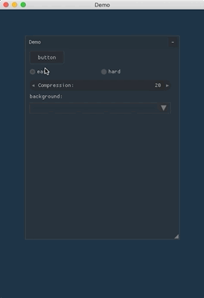

# Nuklear
[](https://travis-ci.com/Gnimuc/Nuklear.jl)
[](https://ci.appveyor.com/project/Gnimuc/Nuklear-jl)

Julia wrapper for [nuklear](https://github.com/vurtun/nuklear), a minimal state immediate mode graphical user interface toolkit written in ANSI C. The bindings are auto-generated using
[Clang.jl](https://github.com/ihnorton/Clang.jl). Please refer to nuklear [docs](https://github.com/vurtun/nuklear) for how to use those C-bindings.

## Installation
```
pkg> add Nuklear
```

## Example
Some basic examples can be found in the `demo` folder.



## Backends

- [x] GLFW.jl + ModernGL.jl
- [ ] SFML(pending upstream)
- [ ] SDL(pending upstream)

## License
Only the Julia code in this repo is released under MIT license. Other assets such as those fonts in the
`demo/extra_font` folder are released under their own license.
